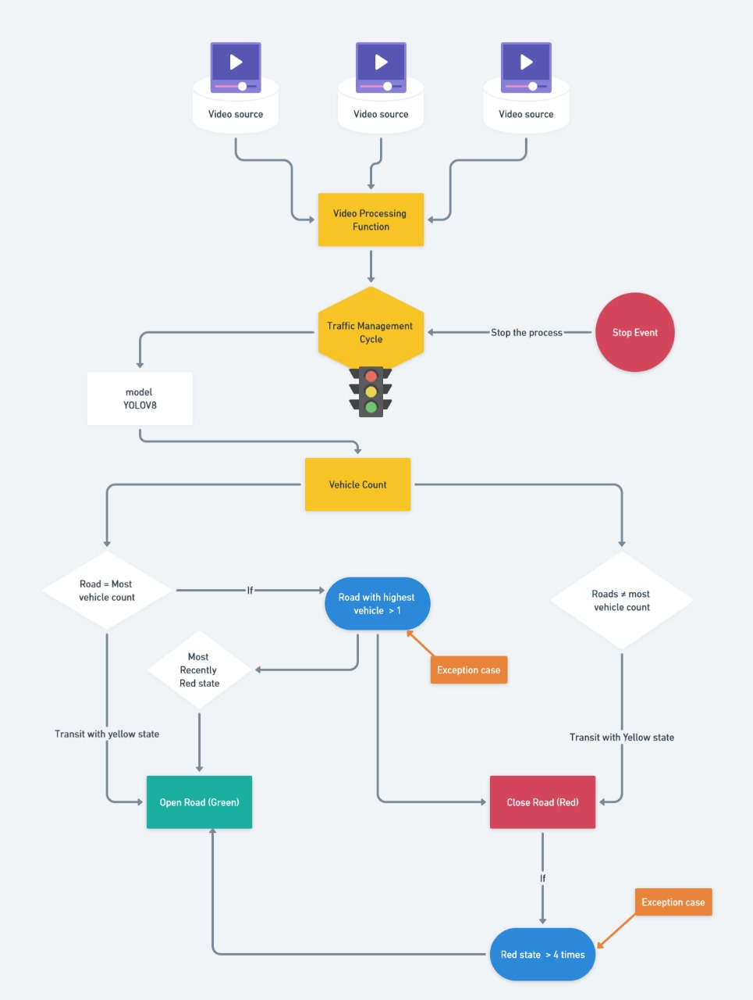

# Street View Traffic Management System

## Project Overview
This project implements an object detection-based approach to manage traffic using YOLO (You Only Look Once) models. The application is built with Streamlit and uses custom logic to determine traffic light states based on video sources. The application allows the use of multiple videos as roads and employs custom logic to determine traffic light states based on video sources.

## Dataset
The dataset used for training the model includes data from the internet and internal YOLO data. You can access the dataset [here](https://universe.roboflow.com/fsmvu/street-view-gdogo).

## Application workflow


## Project Structure
- `FlowChart.jpg`: Contains the flowchart/diagram that explains the logic of the application.

- `api.py`: The Streamlit app that runs the implemented application, allowing the use of multiple videos as roads and determining traffic lights based on video sources.
- `Model/`: Contains the exported YOLO model.
- `Notebooks/`: Contains the notebook to train the YOLOv8 model.
- `requirements.txt`: List of dependencies required to run the project.

## Installation
Clone the repository and navigate to the project directory:
```bash
git clone https://github.com/SanjidHossain/Traffic-Managment-System-YOLO-approach.git
cd Traffic-Managment-System-YOLO-approach
```

Install the required packages:
```bash
pip install -r requirements.txt
```

## Usage
Run the application:
```bash
streamlit run api.py
```
